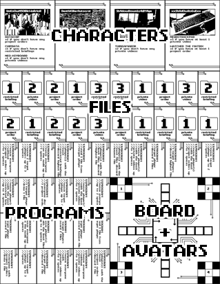
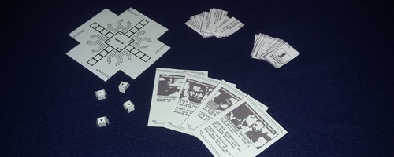

# server.hack() #
a single-page cyberpunk board game for 2-4 players

made for [PROCJAM 2016](https://itch.io/jam/procjam) and [GitHub Game-off 2016](https://github.com/github/game-off-2016)

Live builds of the game can be found [on itch.io](https://sweetheartsquad.itch.io/server-hack) and on [GitHub pages](https://sweetheartsquad.github.io/game-off-2016/) (note that the GitHub version does not generate PDFs).

# How To Play #
## Objective ##
Finish the game with the highest number of File points.

## Pieces ##
- Character cards have a set of 1-3 implants/traits which affect their final score.
- File cards have a point value (0-3) and one of three filetypes. Once drawn, a File remains face-up for the rest of the game.
- Program cards have text which explains what they do.
- The Gameboard has a Server (the center of the board) and four paths leading to the Server.
- The Avatar tokens are cubes used to represent player position on the Gameboard. 

## Setup ##
1. Print a gameset.
2. Cut the gameset into individual pieces.
3. Shuffle Character cards and have each player choose one randomly. Look at your own, but keep these secret from other players until the end of the game.
4. Shuffle the File cards and place the deck facedown by the Gameboard.
5. Shuffle the Program cards and place the deck facedown by the Gameboard.
6. Place an avatar token for each player on the "start" positions on the Gameboard.
7. Decide who goes first.

## Playing ##
- Each player gets 2 actions per turn.
- Actions:
 - Move your Avatar 1 space
 - Draw a Program card facedown
 - Use a Program card
 - If on the Server, draw a File faceup
- Once a player has used both of their actions, the next player starts their turn.
- When Programs are used, place the cards in a separate pile. Once every Program card has been drawn, re-shuffle this pile and use it as the new Program deck.

## Game Over ##
- As soon as the last File is drawn, the game is over. Each player reveals their Character card, and points are tallied. You may not use any remaining Programs.
- A player's points are calculated as the sum of all the Files they hold, plus any bonuses/modifiers from their Character card.

### Ties ###
- If two or more players are tied for first place, continue the game by drawing/playing Programs until the tie is broken.

## Misc. ##
- You can move forwards or backwards. For example: if a player uses the Program "target player moves up to 2 spaces", they could A) target themselves and move forwards, or B) target another player and move them backwards.
- You can choose to do the same action twice on your turn. For example, you could draw two Program cards.
- If multiple players need to draw cards at the same time (e.g. the Program "everyone draw 3 cards"), start with the player who used the Program and continue in turn order.

***

# Gameset Details #
A full gameset is fitted to a single letter-sized piece of paper, which needs to be cut into individual pieces.

When finished cutting, you should have:
- 4 Character cards
- 20 File cards
- 30 Program cards
- 1 Gameboard
- 4 Avatar tokens

The Avatar tokens on the corners of the Gameboard are simple papercrafts, and can be assembled like so:

If you prefer, you can cut out and use the center squares alone to save some setup time.

An example of an entire assembled gameset can be seen below:

***

# Resources Used #
- [jsPDF](https://github.com/MrRio/jsPDF)
- [Wikimedia Commons stock photos](photo credits.txt)
